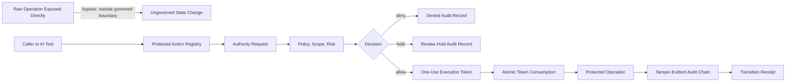

# Architecture

KNOT Guard separates sensitive execution into explicit stages.

## Boundaries

- Policy decides whether authority may exist.
- Tokens bind authority to one actor, action, target, scope, and policy version.
- Replay storage decides whether this token has already been used.
- Audit storage records the transition path.
- Receipts make successful transitions externally referable.

## Why This Is Different From Scanning

Scanners tell you something may be unsafe.

KNOT Guard sits in the execution path and refuses invalid state transitions.
